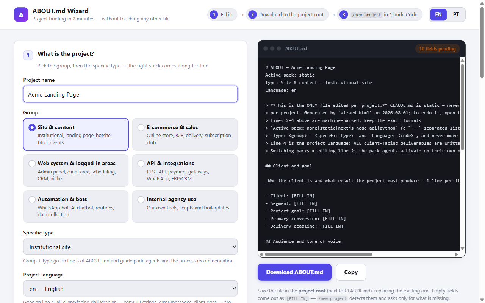

# Setup Claude

**A 2-minute briefing becomes a fully configured Claude Code workspace.**

Most templates give you files to read. Setup Claude gives you a working system:
fill in one briefing form, and every layer wires itself — specialized agents,
process skills, automation hooks, MCP servers, stack scaffolds and quality gates.
You describe the project; the setup configures itself.

## How it works

One file drives everything. `ABOUT.md` holds the briefing (client, goal, audience,
tone, stack, language) — hooks inject it into every session, the right specialist
agents activate on their own, and commands read project facts from it. Switching
stacks or languages is editing one line.

## Quickstart

1. **Use this template** (green button above) or clone the repo into your project folder.
2. Open `wizard.html` in a browser (double-click — no server, no dependencies),
   fill in the briefing, save the generated `ABOUT.md` at the root.
3. Run `claude` and execute `/new-project` — it applies the stack scaffold,
   verifies MCP servers and confirms the setup. Start working.

Already have a codebase? Copy `.claude/`, `CLAUDE.md`, `.mcp.json` and `ABOUT.md`
into the repo and run `/new-project` — it reverse-engineers stack, commands and
project type from the code and asks only what code can't tell. Improving an
existing page? `/audit <url>` delivers a prioritized conversion audit first.

## What's inside

| Layer | What ships |
|---|---|
| **Agents (12)** | 8 universal (frontend, backend, UI design, copywriting, SEO, read-only code review, QA, a11y/performance) + 4 stack specialists that self-activate via the briefing |
| **Process skills (3)** | client-discovery → landing-blueprint → design-direction: research, strategy and art direction gated *before* copy and UI |
| **Commands (6)** | `/new-project`, `/audit`, `/design-review` (screenshot loop at 3 widths), `/review` (APPROVED/BLOCKED gate), `/sync-docs`, `/prime` |
| **Hooks (3)** | Session context auto-injection, post-edit formatting, review reminders — the process runs itself |
| **MCPs** | 5 pre-wired (Playwright, Context7, GitHub, Supabase, Sentry) + a ready-to-paste catalog of 11 more |
| **Stack packs (4)** | Next.js App Router, static HTML/CSS/JS, Node API (TS), Python — each with conventions (PACK.md) and a ready scaffold. Monorepos: activate several at once |
| **Locales** | Deliverable language is per-project config; market knowledge lives in locale files (ships with pt-BR, es, fr, de) |

Universal agents work with **any** stack (`Active pack: none`) — packs are the
included blades, and [adding a pack](.github/CONTRIBUTING.md) is a documented path.

## Requirements

- [Claude Code](https://claude.com/claude-code) (recent version — uses agents, skills, hooks and project MCPs)
- Node.js LTS (hooks and npx-based MCP servers)
- Git
- Optional, per use: Python 3.11+ & [uv](https://docs.astral.sh/uv/) (python pack) · `GITHUB_PAT` env var (GitHub MCP) · one-time `/mcp` OAuth logins (Sentry, Supabase)

## Docs

The full manual — every agent, command, hook, MCP and pack, plus the adoption
guide for existing repos — lives in [`.claude/README.md`](.claude/README.md).
Day-to-day cheat sheet: [`COMMANDS.md`](COMMANDS.md).

## Credits

Setup Claude stands on open work it gladly credits: agent role foundations
distilled from [VoltAgent/awesome-claude-code-subagents](https://github.com/VoltAgent/awesome-claude-code-subagents),
docs architecture inspired by [Claude-Code-Development-Kit](https://github.com/peterkrueck/Claude-Code-Development-Kit),
process methodology via the [superpowers](https://github.com/obra/superpowers) plugin,
and [claude-code-templates](https://github.com/davila7/claude-code-templates) as an
optional bootstrap accelerator. Thank you.

## License

[MIT](LICENSE)
